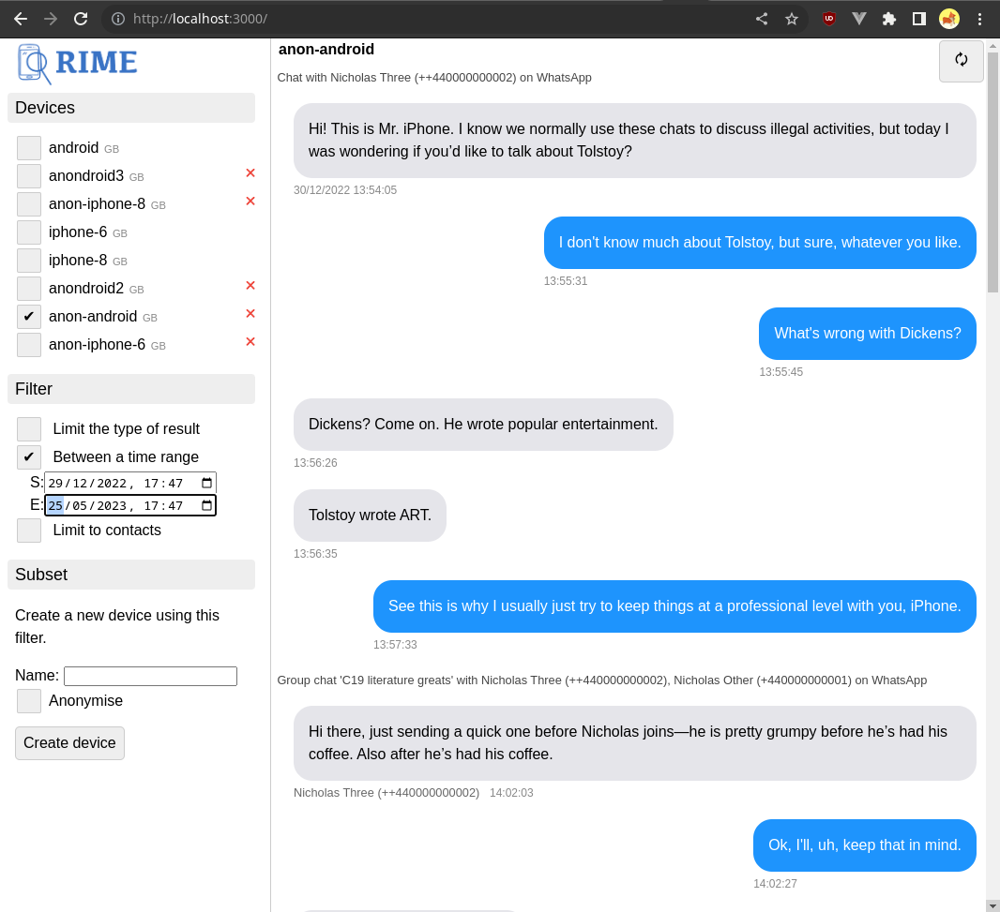

About RIME
==========

RIME is a tool for investigation of Android and iOS mobile device dumps. Its core feature is its GraphQL API for device
investigation. It also includes an example GUI. All features of RIME are accessible via its API, making it both
extensible and easy to integrate into existing data analysis workflows.

RIME's key differentiating feature is its ability to **filter** the mobile device dump to include events from a specific
time range, or to include only a specific set of people, and then to create a **subset** of the device dump containing only
the information supplied by the filter. These features both streamline data investigation and allow data owners to keep
unnecessary information private.

In the GUI, you begin by selecting one or more devices at the top left. Device data is displayed in the right pane. Filtering can be performed underneath the device selector. Multiple devices can be selected; RIME will attempt to align data correctly, but this may have slight variations between devices.
