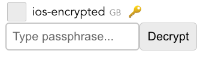

==========
Quickstart
==========

The RIME server is a Python application. The GUI frontend is a Web application written in Vue 3. The simplest way to get
up and running with RIME is to run it with Docker Compose, but you can also run it directly.

Running with Docker Compose
---------------------------

Check out RIME and change to the ``dev`` directory:

.. code-block:: bash

    git clone https://git@github.com:RIME-project/RIME.git
    cd RIME/dev

Now run Docker Compose:

.. code-block:: bash

    docker-compose up

RIME is then accessible at http://localhost:8000.

Running directly
----------------

The simplest method is to run the ``run_dev.sh`` script. This starts up the RIME backend on port 5001, and the frontend
(served by Vite) on port 3000. You can then access RIME at http://localhost:3000.

You'll need Python (3.10 recommended), and node.js (18 or above) with npm. The run_dev script will create a Python
virtualenv and install dependencies automatically. It will also install the frontend dependencies using npm. It will
then run both Flask and Vite.

If the Flask task crashes, you may need to manually kill Vite before restarting.

Getting sample data
-------------------

You can download a sample dataset from https://rime-project.eu/sample-data. This dataset contains images from two iOS
and one Android device.

Alternatively, you can examine data from your own device.

Importing data from an iOS device
^^^^^^^^^^^^^^^^^^^^^^^^^^^^^^^^^

When you connect an iOS device to a Mac, you can see it in the sidebar of the Finder.  Click on it and you'll see a page which allows you to do backups to the Mac.  Make sure the box 'Encrypt local backup' is not ticked.

A backup can then be performed, which will end up under ``~/Library/Application Support/MobileSync``, in a directory with a long hex name.

If you're running under Docker, you can copy this directory under ``example/`` and it will immediately appear in the GUI.
If you're running the backend directly, place it under ``$RIME_FILESYSTEM_BASE_PATH``.

# Importing data from an Android device

TODO

Decrypt encrypted iOS backups
-----------------------------

RIME supports decryption of encrypted iOS backups when the passphrase that was used for the encryptino is provided.
There are two ways to provide RIME with the passphrase to decrypt the encrypted backup.

Encrypted iOS devices are shown with the key icon.

To decrypt though the frontend UI, click the key icon on then provide the passphrase and click "Decrypt"

Alternatively, you can add the passphrase to the RIME configuration file that you are using, for example
if you are using the ``rime_config.yaml`` then provide the passphrase as:

.. code-block:: yaml

    filesystem:
    base_path: "../example/"
    passphrases:
        'ios-encrypted': 'passphrase'
